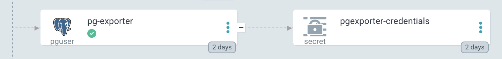

# ArgoCD
This operator can be used with ArgoCD.
In the following sections additional integrations with ArgoCD are described.

## Health Checks
Its possible to add health checks to custom resources.
When this operator is used in ArgoCD the configuration below can be used to enhance the experience in ArgoCD.
See [ArgoCD Documentation](https://argo-cd.readthedocs.io/en/stable/operator-manual/health/#custom-health-checks) for more details.

```yaml
data:
    resource.customizations.useOpenLibs.postgres.brose.bike_PgUser: "true"
    resource.customizations.health.postgres.brose.bike_PgUser: |
        hs = {}
        if obj.status ~= nil then
        if obj.status.conditions ~= nil then
            for i, condition in ipairs(obj.status.conditions) do
            if condition.type ~= nil then
                if condition.type == "postgres.brose.bike/connected" and condition.status == "False" then
                hs.status = "Progressing"
                hs.message = condition.message
                return hs
                end        
                if condition.type == "pguser.postgres.brose.bike/exists" and condition.status == "False" then
                hs.status = "Progressing"
                hs.message = condition.message
                return hs
                end  
                if condition.type:find("^pguser\.postgres\.brose\.bike\/database-") and condition.status == "False" then
                hs.status = "Degraded"
                hs.message = condition.message
                return hs
                end
            end
            end
        end
        end

        hs.status = "Healthy"
        return hs
```


## Styling
When this operator is used in ArgoCD the css styles below can be used to enhance the experience in ArgoCD.




The Logo is used from [Wikimedia](https://upload.wikimedia.org/wikipedia/commons/2/29/Postgresql_elephant.svg) and included as inline svg.
The CSS styles have to be copied to the ArgoCD configuration,
either into the referenced css file or into the `argo-styles-cm` Config Map.
See [here](https://argo-cd.readthedocs.io/en/stable/operator-manual/custom-styles/) for more Inforation.

```css
.application-resource-tree__node--pguser .application-resource-tree__node-kind-icon div:first-child,
.application-resource-tree__node--pgdatabase .application-resource-tree__node-kind-icon div:first-child,
.application-resource-tree__node--pginstance .application-resource-tree__node-kind-icon div:first-child {
    background-image: url("data:image/svg+xml;base64,PD94bWwgdmVyc2lvbj0iMS4wIiBlbmNvZGluZz0iVVRGLTgiPz4KPCFET0NUWVBFIHN2ZyBQVUJMSUMgIi0vL1czQy8vRFREIFNWRyAxLjEvL0VOIiAiaHR0cDovL3d3dy53My5vcmcvR3JhcGhpY3MvU1ZHLzEuMS9EVEQvc3ZnMTEuZHRkIj4KPHN2ZyB3aWR0aD0iNDMyLjA3MXB0IiBoZWlnaHQ9IjQ0NS4zODNwdCIgdmlld0JveD0iMCAwIDQzMi4wNzEgNDQ1LjM4MyIgeG1sOnNwYWNlPSJwcmVzZXJ2ZSIgeG1sbnM9Imh0dHA6Ly93d3cudzMub3JnLzIwMDAvc3ZnIj4KPGcgaWQ9Im9yZ2luYWwiIHN0eWxlPSJmaWxsLXJ1bGU6bm9uemVybztjbGlwLXJ1bGU6bm9uemVybztzdHJva2U6IzAwMDAwMDtzdHJva2UtbWl0ZXJsaW1pdDo0OyI+Cgk8L2c+CjxnIGlkPSJMYXllcl94MDAyMF8zIiBzdHlsZT0iZmlsbC1ydWxlOm5vbnplcm87Y2xpcC1ydWxlOm5vbnplcm87ZmlsbDpub25lO3N0cm9rZTojRkZGRkZGO3N0cm9rZS13aWR0aDoxMi40NjUxO3N0cm9rZS1saW5lY2FwOnJvdW5kO3N0cm9rZS1saW5lam9pbjpyb3VuZDtzdHJva2UtbWl0ZXJsaW1pdDo0OyI+CjxwYXRoIHN0eWxlPSJmaWxsOiMwMDAwMDA7c3Ryb2tlOiMwMDAwMDA7c3Ryb2tlLXdpZHRoOjM3LjM5NTM7c3Ryb2tlLWxpbmVjYXA6YnV0dDtzdHJva2UtbGluZWpvaW46bWl0ZXI7IiBkPSJNMzIzLjIwNSwzMjQuMjI3YzIuODMzLTIzLjYwMSwxLjk4NC0yNy4wNjIsMTkuNTYzLTIzLjIzOWw0LjQ2MywwLjM5MmMxMy41MTcsMC42MTUsMzEuMTk5LTIuMTc0LDQxLjU4Ny03YzIyLjM2Mi0xMC4zNzYsMzUuNjIyLTI3LjcsMTMuNTcyLTIzLjE0OGMtNTAuMjk3LDEwLjM3Ni01My43NTUtNi42NTUtNTMuNzU1LTYuNjU1YzUzLjExMS03OC44MDMsNzUuMzEzLTE3OC44MzYsNTYuMTQ5LTIwMy4zMjIgICAgQzM1Mi41MTQtNS41MzQsMjYyLjAzNiwyNi4wNDksMjYwLjUyMiwyNi44NjlsLTAuNDgyLDAuMDg5Yy05LjkzOC0yLjA2Mi0yMS4wNi0zLjI5NC0zMy41NTQtMy40OTZjLTIyLjc2MS0wLjM3NC00MC4wMzIsNS45NjctNTMuMTMzLDE1LjkwNGMwLDAtMTYxLjQwOC02Ni40OTgtMTUzLjg5OSw4My42MjhjMS41OTcsMzEuOTM2LDQ1Ljc3NywyNDEuNjU1LDk4LjQ3LDE3OC4zMSAgICBjMTkuMjU5LTIzLjE2MywzNy44NzEtNDIuNzQ4LDM3Ljg3MS00Mi43NDhjOS4yNDIsNi4xNCwyMC4zMDcsOS4yNzIsMzEuOTEyLDguMTQ3bDAuODk3LTAuNzY1Yy0wLjI4MSwyLjg3Ni0wLjE1Nyw1LjY4OSwwLjM1OSw5LjAxOWMtMTMuNTcyLDE1LjE2Ny05LjU4NCwxNy44My0zNi43MjMsMjMuNDE2Yy0yNy40NTcsNS42NTktMTEuMzI2LDE1LjczNC0wLjc5NywxOC4zNjdjMTIuNzY4LDMuMTkzLDQyLjMwNSw3LjcxNiw2Mi4yNjgtMjAuMjI0ICAgIGwtMC43OTUsMy4xODhjNS4zMjUsNC4yNiw0Ljk2NSwzMC42MTksNS43Miw0OS40NTJjMC43NTYsMTguODM0LDIuMDE3LDM2LjQwOSw1Ljg1Niw0Ni43NzFjMy44MzksMTAuMzYsOC4zNjksMzcuMDUsNDQuMDM2LDI5LjQwNmMyOS44MDktNi4zODgsNTIuNi0xNS41ODIsNTQuNjc3LTEwMS4xMDciLz4KPHBhdGggc3R5bGU9ImZpbGw6IzMzNjc5MTtzdHJva2U6bm9uZTsiIGQ9Ik00MDIuMzk1LDI3MS4yM2MtNTAuMzAyLDEwLjM3Ni01My43Ni02LjY1NS01My43Ni02LjY1NWM1My4xMTEtNzguODA4LDc1LjMxMy0xNzguODQzLDU2LjE1My0yMDMuMzI2Yy01Mi4yNy02Ni43ODUtMTQyLjc1Mi0zNS4yLTE0NC4yNjItMzQuMzhsLTAuNDg2LDAuMDg3Yy05LjkzOC0yLjA2My0yMS4wNi0zLjI5Mi0zMy41Ni0zLjQ5NmMtMjIuNzYxLTAuMzczLTQwLjAyNiw1Ljk2Ny01My4xMjcsMTUuOTAyICAgIGMwLDAtMTYxLjQxMS02Ni40OTUtMTUzLjkwNCw4My42M2MxLjU5NywzMS45MzgsNDUuNzc2LDI0MS42NTcsOTguNDcxLDE3OC4zMTJjMTkuMjYtMjMuMTYzLDM3Ljg2OS00Mi43NDgsMzcuODY5LTQyLjc0OGM5LjI0Myw2LjE0LDIwLjMwOCw5LjI3MiwzMS45MDgsOC4xNDdsMC45MDEtMC43NjVjLTAuMjgsMi44NzYtMC4xNTIsNS42ODksMC4zNjEsOS4wMTljLTEzLjU3NSwxNS4xNjctOS41ODYsMTcuODMtMzYuNzIzLDIzLjQxNiAgICBjLTI3LjQ1OSw1LjY1OS0xMS4zMjgsMTUuNzM0LTAuNzk2LDE4LjM2N2MxMi43NjgsMy4xOTMsNDIuMzA3LDcuNzE2LDYyLjI2Ni0yMC4yMjRsLTAuNzk2LDMuMTg4YzUuMzE5LDQuMjYsOS4wNTQsMjcuNzExLDguNDI4LDQ4Ljk2OWMtMC42MjYsMjEuMjU5LTEuMDQ0LDM1Ljg1NCwzLjE0Nyw0Ny4yNTRjNC4xOTEsMTEuNCw4LjM2OCwzNy4wNSw0NC4wNDIsMjkuNDA2YzI5LjgwOS02LjM4OCw0NS4yNTYtMjIuOTQyLDQ3LjQwNS01MC41NTUgICAgYzEuNTI1LTE5LjYzMSw0Ljk3Ni0xNi43MjksNS4xOTQtMzQuMjhsMi43NjgtOC4zMDljMy4xOTItMjYuNjExLDAuNTA3LTM1LjE5NiwxOC44NzItMzEuMjAzbDQuNDYzLDAuMzkyYzEzLjUxNywwLjYxNSwzMS4yMDgtMi4xNzQsNDEuNTkxLTdjMjIuMzU4LTEwLjM3NiwzNS42MTgtMjcuNywxMy41NzMtMjMuMTQ4eiIvPgo8cGF0aCBkPSJNMjE1Ljg2NiwyODYuNDg0Yy0xLjM4NSw0OS41MTYsMC4zNDgsOTkuMzc3LDUuMTkzLDExMS40OTVjNC44NDgsMTIuMTE4LDE1LjIyMywzNS42ODgsNTAuOSwyOC4wNDVjMjkuODA2LTYuMzksNDAuNjUxLTE4Ljc1Niw0NS4zNTctNDYuMDUxYzMuNDY2LTIwLjA4MiwxMC4xNDgtNzUuODU0LDExLjAwNS04Ny4yODEiLz4KPHBhdGggZD0iTTE3My4xMDQsMzguMjU2YzAsMC0xNjEuNTIxLTY2LjAxNi0xNTQuMDEyLDg0LjEwOWMxLjU5NywzMS45MzgsNDUuNzc5LDI0MS42NjQsOTguNDczLDE3OC4zMTZjMTkuMjU2LTIzLjE2NiwzNi42NzEtNDEuMzM1LDM2LjY3MS00MS4zMzUiLz4KPHBhdGggZD0iTTI2MC4zNDksMjYuMjA3Yy01LjU5MSwxLjc1Myw4OS44NDgtMzQuODg5LDE0NC4wODcsMzQuNDE3YzE5LjE1OSwyNC40ODQtMy4wNDMsMTI0LjUxOS01Ni4xNTMsMjAzLjMyOSIvPgo8cGF0aCBzdHlsZT0ic3Ryb2tlLWxpbmVqb2luOmJldmVsOyIgZD0iTTM0OC4yODIsMjYzLjk1M2MwLDAsMy40NjEsMTcuMDM2LDUzLjc2NCw2LjY1M2MyMi4wNC00LjU1Miw4Ljc3NiwxMi43NzQtMTMuNTc3LDIzLjE1NWMtMTguMzQ1LDguNTE0LTU5LjQ3NCwxMC42OTYtNjAuMTQ2LTEuMDY5Yy0xLjcyOS0zMC4zNTUsMjEuNjQ3LTIxLjEzMywxOS45Ni0yOC43MzljLTEuNTI1LTYuODUtMTEuOTc5LTEzLjU3My0xOC44OTQtMzAuMzM4ICAgIGMtNi4wMzctMTQuNjMzLTgyLjc5Ni0xMjYuODQ5LDIxLjI4Ny0xMTAuMTgzYzMuODEzLTAuNzg5LTI3LjE0Ni05OS4wMDItMTI0LjU1My0xMDAuNTk5Yy05Ny4zODUtMS41OTctOTQuMTksMTE5Ljc2Mi05NC4xOSwxMTkuNzYyIi8+CjxwYXRoIGQ9Ik0xODguNjA0LDI3NC4zMzRjLTEzLjU3NywxNS4xNjYtOS41ODQsMTcuODI5LTM2LjcyMywyMy40MTdjLTI3LjQ1OSw1LjY2LTExLjMyNiwxNS43MzMtMC43OTcsMTguMzY1YzEyLjc2OCwzLjE5NSw0Mi4zMDcsNy43MTgsNjIuMjY2LTIwLjIyOWM2LjA3OC04LjUwOS0wLjAzNi0yMi4wODYtOC4zODUtMjUuNTQ3Yy00LjAzNC0xLjY3MS05LjQyOC0zLjc2NS0xNi4zNjEsMy45OTR6Ii8+CjxwYXRoIGQ9Ik0xODcuNzE1LDI3NC4wNjljLTEuMzY4LTguOTE3LDIuOTMtMTkuNTI4LDcuNTM2LTMxLjk0MmM2LjkyMi0xOC42MjYsMjIuODkzLTM3LjI1NSwxMC4xMTctOTYuMzM5Yy05LjUyMy00NC4wMjktNzMuMzk2LTkuMTYzLTczLjQzNi0zLjE5M2MtMC4wMzksNS45NjgsMi44ODksMzAuMjYtMS4wNjcsNTguNTQ4Yy01LjE2MiwzNi45MTMsMjMuNDg4LDY4LjEzMiw1Ni40NzksNjQuOTM4Ii8+CjxwYXRoIHN0eWxlPSJmaWxsOiNGRkZGRkY7c3Ryb2tlLXdpZHRoOjQuMTU1O3N0cm9rZS1saW5lY2FwOmJ1dHQ7c3Ryb2tlLWxpbmVqb2luOm1pdGVyOyIgZD0iTTE3Mi41MTcsMTQxLjdjLTAuMjg4LDIuMDM5LDMuNzMzLDcuNDgsOC45NzYsOC4yMDdjNS4yMzQsMC43Myw5LjcxNC0zLjUyMiw5Ljk5OC01LjU1OWMwLjI4NC0yLjAzOS0zLjczMi00LjI4NS04Ljk3Ny01LjAxNWMtNS4yMzctMC43MzEtOS43MTksMC4zMzMtOS45OTYsMi4zNjd6Ii8+CjxwYXRoIHN0eWxlPSJmaWxsOiNGRkZGRkY7c3Ryb2tlLXdpZHRoOjIuMDc3NTtzdHJva2UtbGluZWNhcDpidXR0O3N0cm9rZS1saW5lam9pbjptaXRlcjsiIGQ9Ik0zMzEuOTQxLDEzNy41NDNjMC4yODQsMi4wMzktMy43MzIsNy40OC04Ljk3Niw4LjIwN2MtNS4yMzgsMC43My05LjcxOC0zLjUyMi0xMC4wMDUtNS41NTljLTAuMjc3LTIuMDM5LDMuNzQtNC4yODUsOC45NzktNS4wMTVjNS4yMzktMC43Myw5LjcxOCwwLjMzMywxMC4wMDIsMi4zNjh6Ii8+CjxwYXRoIGQ9Ik0zNTAuNjc2LDEyMy40MzJjMC44NjMsMTUuOTk0LTMuNDQ1LDI2Ljg4OC0zLjk4OCw0My45MTRjLTAuODA0LDI0Ljc0OCwxMS43OTksNTMuMDc0LTcuMTkxLDgxLjQzNSIvPgo8cGF0aCBzdHlsZT0ic3Ryb2tlLXdpZHRoOjM7IiBkPSJNMCw2MC4yMzIiLz4KPC9nPgo8L3N2Zz4=");
    background-color: rgba(255,255,255,1) !important;
    background-position: center;
    background-size: 80%;
    background-repeat: no-repeat;
}
.application-resource-tree__node--pguser .application-resource-tree__node-kind-icon div:first-child span,
.application-resource-tree__node--pgdatabase .application-resource-tree__node-kind-icon div:first-child span,
.application-resource-tree__node--pginstance .application-resource-tree__node-kind-icon div:first-child span {
    display: none;
}
```